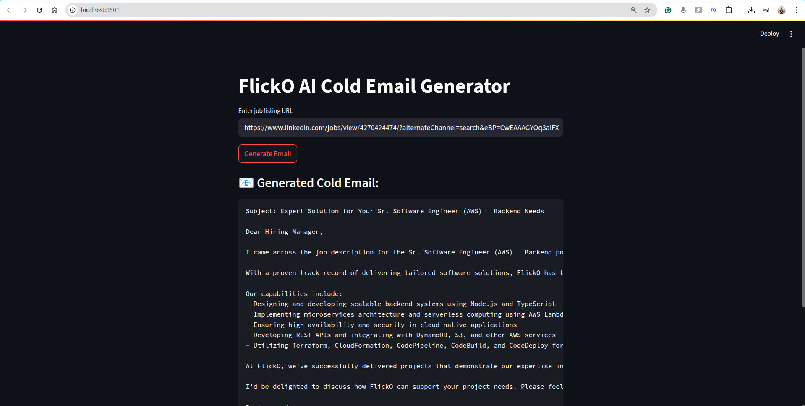

# cold-email-gen-langchain-groq-chromaDB-vectorDB

```
experimentation and testing space for AI, langchain, vectorDB etc.
```

## Install jupyter notebook

```
python3 -m venv ai-playground
source ai-playground/bin/activate
```

# Required installations

```
pip install langchain
pip install -qU langchain-groq
pip install chromadb
pip install -qU langchain_community beautifulsoup4
pip install streamlit
```

# Imp links

```
https://python.langchain.com/docs/integrations/chat/groq/
https://docs.trychroma.com/docs/overview/getting-started
https://console.groq.com/docs/models
```

# command to run app

```
streamlit run app.py
```


